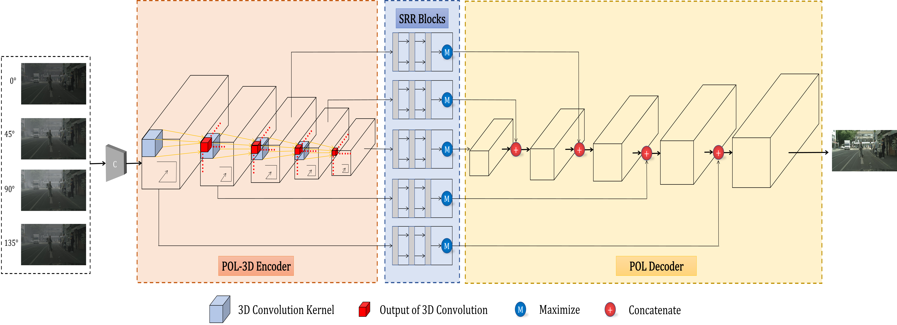
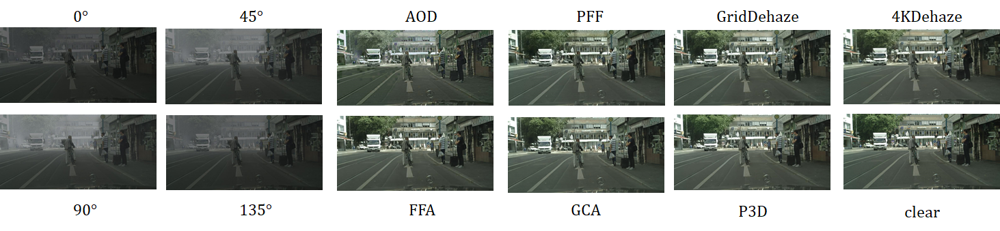
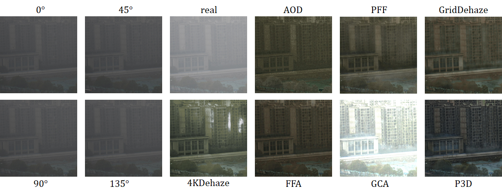

# P3DNet: Polarization-based Image Dehazing Network with 3D Convolution

By Xin Wang, Haichao Yu, Yong Zhang, Jun Gao



## Abstract

Due to the large number of microscopic particles contained in the haze, the atmospheric light is dispersed, resulting in severe degradation of the quality of the captured images. It will lead to noticeable visual quality degradation in object appearance and contrast, which gravely affect many visual algorithms’ performance, including object detection and visual perception. Although single-image dehazing has shown great effectiveness in many previous studies, the handcrafted priors or learned features from synthetic training data make it hard to generalize well for real-world images. Polarization is one of the inherent properties of the light field that contains abundant target and environmental information. Polarization-based multi-image dehazing can relieve the ill-posedness by utilizing the physical image formation model with less dependency on features extracted from training images. In this paper, we construct a novel end-to-end dehazing network tailored to process polarization images. Based on 3D Convolution, the POL-3D Encoder is able to exploit the correlation information in the polarization angle dimension from fused polarization images. Moreover, Octave Convolution is used in the Spatial Redundancy-Reducing (SRR) module to reduce the redundancy of feature maps in the spatial dimension. For training and verifying the effectiveness of our network, we generate a polarization-based dataset by employing the generalized physical formation model. Experimental results indicate that our method achieves state-of-the-art performance on both synthetic data and real-world hazy images. 

## Train

- Generate your own data

  - [GitHub - fourson/Learning-to-dehaze-with-polarization: NeurIPS 2021 paper: Learning to Dehaze with Polarization](https://github.com/fourson/Learning-to-dehaze-with-polarization)
  - 利用上述论文提供的方法生成数据集，放在datasets文件夹下，分为train、val、test

- 运行命令

  ```
  python train.py
  ```

- 模型保存在./checkpoints文件夹下。

## Demo

- ```
  python test.py
  ```

- 测试结果可在./test_result文件夹下找到。

## Samples





